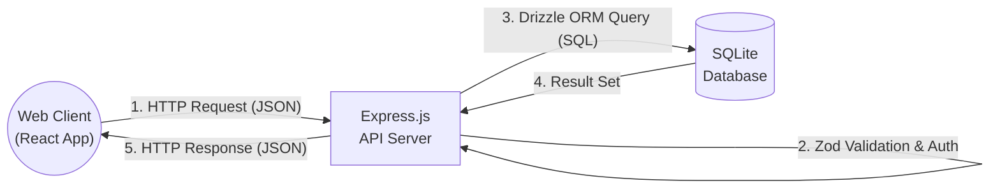

# Chapter 1: Introduction

## 1.1 Project Title and Abstract
**Project Title**: Localfluence: A Hyperlocal Creator Marketplace

**Abstract**: 
The rapid growth of the digital economy has positioned social media influencers and creators as primary drivers of consumer behavior. However, localized businesses (such as local restaurants, boutique shops, and local service providers) often struggle to find and collaborate with relevant influencers within their immediate geographical vicinity. The traditional influencer marketing platforms are heavily skewed towards global or national-scale campaigns, making them cost-prohibitive and inefficient for small-to-medium enterprises (SMEs). 

*Localfluence* bridges this gap by introducing a hyperlocal creator marketplace. The platform connects social media creators directly with startups and local businesses for meaningful collaborations. The application provides a seamless, end-to-end ecosystem where businesses can discover influencers based on local relevance, send collaboration requests, negotiate terms in real-time through an integrated chat system, and leave reviews to build an ecosystem of trust. By leveraging modern web technologies (React, Vite, Node.js, and SQLite), Localfluence ensures high performance, robust security, and an intuitive user experience for both creators and business owners.

## 1.2 Problem Statement
Despite the proven ROI of influencer marketing, local businesses face a significant barrier to entry. They lack the tools to effectively identify creators who have genuine influence within their specific city or neighborhood. Conversely, micro and nano-influencers who possess highly engaged, localized audiences struggle to monetize their reach because traditional platforms prioritize macro-influencers with millions of followers. 

The existing ecosystem is plagued by:
1. **Lack of Geolocation Focus**: Existing platforms do not adequately filter creators by hyperlocal radiuses.
2. **Communication Fragmentation**: Negotiations happen over disparate channels (email, Instagram DMs, WhatsApp), leading to lost messages and misaligned expectations.
3. **High Intermediary Fees**: Agency models charge exorbitant finder's fees.
4. **Lack of Transparency**: Businesses have no reliable way to gauge the past performance or professionalism of a local creator before hiring them.

## 1.3 Proposed Solution (Localfluence App)
To address the aforementioned problems, the Localfluence application is proposed as a centralized, hyperlocal marketplace. The platform acts as a digital intermediary that standardizes the discovery, communication, and transaction phases of local influencer marketing. 

Key features of the proposed solution include:
- **Role-Based Ecosystem**: Distinct onboarding and dashboard experiences for 'Influencers' and 'Businesses'.
- **Hyperlocal Discovery Engine**: Businesses can view influencer profiles, including their niches, follower counts, and localized engagement metrics.
- **Campaign Management**: Businesses can post public campaigns with specified budgets and deliverables.
- **Request Pipeline**: Influencers can apply to campaigns, or businesses can directly request specific influencers.
- **Real-Time Communication**: An integrated chat system allows both parties to discuss deliverables securely within the app.

## 1.4 Objectives of the System
The primary objectives of developing the Localfluence system are:
1. **To democratize influencer marketing** by making it accessible and affordable for local startups and SMEs.
2. **To empower micro-creators** by providing them with a steady stream of localized monetization opportunities.
3. **To streamline the collaboration workflow** from initial discovery to final review within a single, unified interface.
4. **To implement a highly scalable architectural design** utilizing modern JavaScript/TypeScript paradigms to ensure long-term maintainability.

## 1.5 Scope of the Project
The scope of this project encompasses the design, development, testing, and deployment of a full-stack web application. 
- **Frontend Scope**: Development of a responsive, single-page application (SPA) using React, styled with Tailwind CSS.
- **Backend Scope**: Implementation of a RESTful API using Node.js and Express, coupled with a robust relational database schema managed via Drizzle ORM and SQLite.

---

# Chapter 2: System Analysis and Requirements

## 2.1 Feasibility Study
Before initiating the development life cycle, a comprehensive feasibility study was conducted to assess the viability of the Localfluence platform.

### 2.1.1 Technical Feasibility
The project is technically feasible. The chosen technology stack (Vite, React, Node.js, Express, SQLite) is mature, heavily documented, and supported by a vast open-source community. The development team possesses the requisite skills in TypeScript to ensure type safety across the entire monorepo structure.

### 2.1.2 Economic Feasibility
The project is economically feasible. By utilizing open-source frameworks and local SQLite databases for development, the initial software licensing and infrastructure costs are effectively zero. 

### 2.1.3 Operational Feasibility
The platform is designed with a user-centric philosophy. The intuitive interfaces for campaign creation and influencer discovery ensure a low learning curve, meaning the system will be readily accepted by its target demographic.

## 2.2 Hardware and Software Requirements

The following table dictates the minimum and recommended system requirements for running the Localfluence development environment and server infrastructure.

| Component | Minimum Requirement | Recommended Specification | Justification |
| :--- | :--- | :--- | :--- |
| **Processor** | Intel Core i3 / AMD Ryzen 3 | Intel Core i5 / AMD Ryzen 5 or higher | Required for concurrent execution of Vite and Express servers. |
| **RAM** | 8 GB | 16 GB | Node.js and React caching require substantial in-memory storage. |
| **Storage** | 128 GB SSD | 256 GB NVMe SSD | SSD is required for fast `node_modules` resolution and SQLite read/writes. |
| **OS** | Windows 10, macOS 11, Linux | Windows 11, macOS 13, Ubuntu 22.04 | Modern terminal support and optimal Docker compatibility if containerized. |
| **Runtime** | Node.js v18.x | Node.js v20.x (LTS) | Required to run the Express backend and Vite frontend build tools. |
| **Package Manager**| npm v9 | pnpm v8+ | `pnpm` is strictly required for the monorepo workspace resolution. |
| **Database** | SQLite 3 | SQLite 3 | Embedded database for zero-configuration local development. |

## 2.3 Functional Requirements

Functional requirements define the core behaviors and capabilities of the Localfluence system. The following table summarizes the key functional modules:

| Module | Feature ID | Description | Target Role |
| :--- | :--- | :--- | :--- |
| **Authentication** | AUTH-01 | User registration with Email and Password hashing. | All Users |
| **Authentication** | AUTH-02 | JWT-based session management and secure HTTP-only cookies. | All Users |
| **Profile** | PROF-01 | Influencer dashboard to update niche, follower count, and bio. | Influencer |
| **Profile** | PROF-02 | Business dashboard to update company details and industry. | Business |
| **Campaigns** | CAMP-01 | Create, Read, Update, Delete (CRUD) operations for marketing campaigns. | Business |
| **Campaigns** | CAMP-02 | View feed of active, locally relevant campaigns. | Influencer |
| **Requests** | REQ-01 | Apply to a specific campaign with a custom proposal message. | Influencer |
| **Requests** | REQ-02 | Accept or reject an incoming influencer application. | Business |
| **Messaging** | MSG-01 | Real-time peer-to-peer text messaging between matched parties. | All Users |

### 2.3.1 System Use Case Diagram

The following Use Case Diagram illustrates the interactions between the primary actors (Influencer and Business) and the Localfluence system.

```mermaid
usecaseDiagram
    actor "Influencer" as Inf
    actor "Local Business" as Bus
    
    package "Localfluence System" {
        usecase "Register & Login" as UC1
        usecase "Manage Profile" as UC2
        usecase "Post Campaign" as UC3
        usecase "Browse Campaigns" as UC4
        usecase "Apply to Campaign" as UC5
        usecase "Review Applications" as UC6
        usecase "Send Messages" as UC7
    }
    
    Inf --> UC1
    Bus --> UC1
    
    Inf --> UC2
    Bus --> UC2
    
    Bus --> UC3
    Inf --> UC4
    Inf --> UC5
    Bus --> UC6
    
    Inf --> UC7
    Bus --> UC7
```

## 2.4 Non-Functional Requirements
Non-functional requirements specify the quality attributes of the system.
- **Performance**: API responses should load within 300ms under normal load.
- **Security**: All API routes must be protected against SQL injection (handled via Drizzle ORM) and Cross-Site Scripting (XSS). Passwords must never be stored in plain text.
- **Usability**: The frontend must follow responsive design principles, ensuring seamless operation on mobile devices.
- **Maintainability**: The codebase must utilize TypeScript to enforce strict type definitions.

---

# Chapter 3: System Design & Architecture

## 3.1 System Architecture Overview
The Localfluence platform follows a strict decoupled Client-Server architecture utilizing a modern Monorepo structure managed by `pnpm`.

### Monorepo Structure Table

| Package Name | Directory | Technology | Responsibility |
| :--- | :--- | :--- | :--- |
| **API Server** | `artifacts/api-server/` | Node.js, Express | Handles HTTP routing, business logic, and security middleware. |
| **Frontend Client** | `artifacts/localfluence/` | React, Vite, Tailwind | Renders the User Interface and manages client-side state. |
| **Database Schema** | `lib/db/` | Drizzle ORM, SQLite | Defines the relational tables and database connection pool. |
| **API Client React** | `lib/api-client-react/` | React Query | Auto-generated/Shared hooks for fetching data from the API. |
| **Shared Zod Schemas**| `lib/api-zod/` | Zod | Provides single-source-of-truth validation schemas for both Frontend and Backend. |

## 3.2 Technology Stack Justification
1. **React (with Vite)**: React allows for highly dynamic, component-driven user interfaces. Vite is chosen over Webpack for its incredibly fast Hot Module Replacement (HMR).
2. **Tailwind CSS & Radix UI**: Tailwind provides utility-first styling for rapid UI prototyping. Radix UI primitives are used to build accessible, unstyled components.
3. **Node.js & Express**: Node.js provides a non-blocking, event-driven architecture ideal for REST APIs.
4. **SQLite & Drizzle ORM**: SQLite is utilized for a zero-configuration relational database. Drizzle ORM is selected for its supreme TypeScript inference.

## 3.3 Data Flow Architecture

The data flow within the system follows a standard unidirectional pattern, seamlessly passing data from the presentation layer down to the persistence layer and back.

### Level 0 Data Flow Diagram (Context Diagram)



### Request Lifecycle
1. **Client Action**: A user interacts with a React component.
2. **API Call**: The frontend utilizes `@tanstack/react-query` to dispatch a fetch request to the API server.
3. **Validation**: The Express server intercepts the request and validates the payload using shared Zod schemas.
4. **Database Transaction**: If valid, the server executes a query via Drizzle ORM against the SQLite database.
5. **Response**: The database confirms the insertion, and the server responds with an HTTP status code.
6. **State Update**: React Query invalidates the local cache and triggers a UI re-render.
