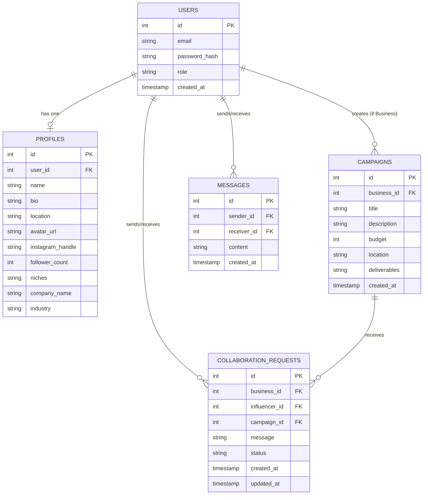

# Chapter 4: Database Design

The foundation of the Localfluence platform relies on a normalized relational database. Data persistence is managed using SQLite natively in development and interacts programmatically via Drizzle ORM. Drizzle provides zero-dependency, type-safe SQL query building which perfectly aligns with our TypeScript monorepo architecture.

## 4.1 Entity Relationship Model
The system comprises five core entities:
1. **Users**: The central authentication entity.
2. **Profiles**: A 1-to-1 extension of the Users table holding business or influencer specific metadata.
3. **Campaigns**: A 1-to-Many entity owned by a Business user representing a marketing opportunity.
4. **Collaboration Requests**: A Many-to-Many join entity linking Businesses and Influencers, optionally referencing a specific Campaign.
5. **Messages**: A self-referencing Many-to-Many entity acting as a ledger of peer-to-peer chat logs.

### Entity Relationship (ER) Diagram
The following Mermaid diagram visualizes the cardinalities and foreign key relationships between the core entities.



## 4.2 Database Schema Detailed Breakdown

### 4.2.1 The Users Entity
The `users` table handles the core identity and authentication state. 

**Data Dictionary: Users Table**
| Column Name | Data Type | Constraints | Description |
| :--- | :--- | :--- | :--- |
| `id` | Integer | Primary Key, Auto Increment | Unique identifier for the user. |
| `email` | Text | Not Null, Unique | User's email address used for authentication. |
| `password_hash` | Text | Not Null | Bcrypt encrypted password string. |
| `role` | Text | Not Null | User role ('business' or 'influencer'). |
| `created_at` | Integer | Not Null, Default(Now) | Unix timestamp of account creation. |

**Drizzle Schema Implementation (`users.ts`):**
```typescript
import { sqliteTable, integer, text } from "drizzle-orm/sqlite-core";
import { sql } from "drizzle-orm";

export const usersTable = sqliteTable("users", {
  id: integer("id").primaryKey({ autoIncrement: true }),
  email: text("email").notNull().unique(),
  passwordHash: text("password_hash").notNull(),
  role: text("role").notNull(),
  createdAt: integer("created_at", { mode: 'timestamp' })
    .notNull()
    .default(sql`(strftime('%s', 'now'))`),
});
export type User = typeof usersTable.$inferSelect;
```

### 4.2.2 The Profiles Entity
Because Businesses and Influencers require completely different metadata, a polymorphic extended `profiles` table is utilized.

**Data Dictionary: Profiles Table**
| Column Name | Data Type | Constraints | Description |
| :--- | :--- | :--- | :--- |
| `id` | Integer | Primary Key | Unique profile identifier. |
| `user_id` | Integer | Not Null, FK(users.id) | Foreign key mapping 1:1 to the Users table. On Delete Cascade. |
| `name` | Text | Not Null | The display name of the user. |
| `bio` | Text | Default("") | Short biography or description. |
| `location` | Text | Default("") | Geographic location of the user. |
| `avatar_url` | Text | Nullable | URL pointing to an uploaded profile image. |
| `instagram_handle` | Text | Nullable | Influencer specific: Instagram username. |
| `follower_count` | Integer | Default(0) | Influencer specific: Number of followers. |
| `niches` | Text | Nullable | Influencer specific: Content categories. |
| `company_name` | Text | Nullable | Business specific: Official company name. |
| `industry` | Text | Nullable | Business specific: Operational sector. |

**Drizzle Schema Implementation (`profiles.ts`):**
```typescript
import { sqliteTable, integer, text } from "drizzle-orm/sqlite-core";
import { usersTable } from "./users";

export const profilesTable = sqliteTable("profiles", {
  id: integer("id").primaryKey({ autoIncrement: true }),
  userId: integer("user_id")
    .notNull()
    .references(() => usersTable.id, { onDelete: "cascade" }),
  name: text("name").notNull(),
  bio: text("bio").default(""),
  location: text("location").default(""),
  avatarUrl: text("avatar_url"),
  // Influencer specific
  instagramHandle: text("instagram_handle"),
  followerCount: integer("follower_count").default(0),
  niches: text("niches"),
  // Business specific
  companyName: text("company_name"),
  industry: text("industry"),
});
```

### 4.2.3 The Campaigns Entity
Businesses post campaigns to attract influencers. This table enforces referential integrity through foreign keys cascading deletions if a business deletes its account.

**Data Dictionary: Campaigns Table**
| Column Name | Data Type | Constraints | Description |
| :--- | :--- | :--- | :--- |
| `id` | Integer | Primary Key | Unique campaign identifier. |
| `business_id` | Integer | Not Null, FK(users.id) | Foreign key identifying the business owner. |
| `title` | Text | Not Null | Title of the campaign. |
| `description`| Text | Default("") | Detailed requirements for the campaign. |
| `budget` | Integer | Not Null, Default(0) | Financial compensation offered (in cents). |
| `location` | Text | Default("") | The target hyperlocal area. |
| `deliverables`| Text | Default("") | What the influencer must provide (e.g., 1 Reel, 2 Stories). |
| `created_at` | Integer | Not Null, Default(Now) | Timestamp of campaign creation. |

**Drizzle Schema Implementation (`campaigns.ts`):**
```typescript
export const campaignsTable = sqliteTable("campaigns", {
  id: integer("id").primaryKey({ autoIncrement: true }),
  businessId: integer("business_id")
    .notNull()
    .references(() => usersTable.id, { onDelete: "cascade" }),
  title: text("title").notNull(),
  description: text("description").notNull().default(""),
  budget: integer("budget").notNull().default(0),
  location: text("location").notNull().default(""),
  deliverables: text("deliverables").notNull().default(""),
  createdAt: integer("created_at", { mode: 'timestamp' })
    .notNull()
    .default(sql`(strftime('%s', 'now'))`),
});
```

### 4.2.4 Collaboration Requests
This table tracks the state machine of an application pipeline. 

**Data Dictionary: Collaboration Requests Table**
| Column Name | Data Type | Constraints | Description |
| :--- | :--- | :--- | :--- |
| `id` | Integer | Primary Key | Unique request identifier. |
| `business_id`| Integer | Not Null, FK(users.id) | Target or Originating business. |
| `influencer_id`| Integer | Not Null, FK(users.id)| Target or Originating influencer. |
| `campaign_id`| Integer | Nullable, FK(campaigns.id)| Optional link to a specific campaign. |
| `message` | Text | Nullable | Initial outreach or proposal message. |
| `status` | Text | Default("pending") | State of request: 'pending', 'accepted', 'rejected'. |
| `created_at` | Integer | Not Null, Default(Now) | Timestamp. |
| `updated_at` | Integer | Not Null, Default(Now) | Updated automatically via Drizzle hooks. |

**Drizzle Schema Implementation (`requests.ts`):**
```typescript
export const requestsTable = sqliteTable("collaboration_requests", {
  id: integer("id").primaryKey({ autoIncrement: true }),
  businessId: integer("business_id")
    .notNull()
    .references(() => usersTable.id, { onDelete: "cascade" }),
  influencerId: integer("influencer_id")
    .notNull()
    .references(() => usersTable.id, { onDelete: "cascade" }),
  campaignId: integer("campaign_id").references(() => campaignsTable.id, {
    onDelete: "set null",
  }),
  message: text("message"),
  status: text("status").notNull().default("pending"),
  createdAt: integer("created_at", { mode: 'timestamp' })
    .notNull()
    .default(sql`(strftime('%s', 'now'))`),
  updatedAt: integer("updated_at", { mode: 'timestamp' })
    .notNull()
    .default(sql`(strftime('%s', 'now'))`)
    .$onUpdate(() => new Date()),
});
```

### 4.2.5 The Messages Entity
To facilitate peer-to-peer chat, a messages log is maintained.

**Data Dictionary: Messages Table**
| Column Name | Data Type | Constraints | Description |
| :--- | :--- | :--- | :--- |
| `id` | Integer | Primary Key | Unique message identifier. |
| `sender_id` | Integer | Not Null, FK(users.id) | The user who sent the message. |
| `receiver_id`| Integer | Not Null, FK(users.id) | The intended recipient. |
| `content` | Text | Not Null | The actual text of the message. |
| `created_at` | Integer | Not Null, Default(Now) | Timestamp of transmission. |

**Drizzle Schema Implementation (`messages.ts`):**
```typescript
export const messagesTable = sqliteTable("messages", {
  id: integer("id").primaryKey({ autoIncrement: true }),
  senderId: integer("sender_id")
    .notNull()
    .references(() => usersTable.id, { onDelete: "cascade" }),
  receiverId: integer("receiver_id")
    .notNull()
    .references(() => usersTable.id, { onDelete: "cascade" }),
  content: text("content").notNull(),
  createdAt: integer("created_at", { mode: 'timestamp' })
    .notNull()
    .default(sql`(strftime('%s', 'now'))`),
});
```

---

# Chapter 5: Implementation Details

## 5.1 Backend Implementation (API Server)
The API Server is constructed using Node.js and Express. It exposes standard RESTful endpoints serving JSON payloads.

### Routing Structure
The backend splits routes hierarchically:
- `/api/auth`: Handles `POST /signup`, `POST /login`, and `POST /logout`.
- `/api/campaigns`: Handles CRUD operations for campaigns.
- `/api/influencers`: Provides endpoints to list and filter influencers for the discovery engine.
- `/api/requests`: Manages the state machine of collaboration applications.
- `/api/messages`: Handles historical chat retrieval.

### Middleware Implementation
Two critical middlewares protect the API:
1. **Authentication Middleware**: Extracts the JWT token from HTTP-only cookies, verifies the cryptographic signature using `jsonwebtoken`, and attaches the decoded user context to the Express `req` object. If the token is invalid or expired, a `401 Unauthorized` response is emitted.
2. **Validation Middleware (Zod)**: Before a request reaches the controller logic, it passes through a validation layer. We utilize Zod schemas to ensure the incoming `req.body` matches the exact structural requirements.

## 5.2 Frontend Implementation
The frontend is a dynamic Single Page Application (SPA) powered by React. 

### Component Architecture
We employ an atomic design methodology for React components:
- **Atoms**: Base UI elements provided by Radix UI (e.g., `Button`, `Input`, `Label`).
- **Molecules**: Combinations of atoms (e.g., `FormField` which contains a Label, Input, and Error Message).
- **Organisms**: Complex layout sections (e.g., `CampaignCard`, `ChatWindow`).
- **Templates/Pages**: Full screen views assigned to React Router paths (e.g., `DashboardPage`, `DiscoveryPage`).

### State Management
State is managed hierarchically depending on its scope:
1. **Server State**: Managed by `@tanstack/react-query`. This library handles caching, deduplication, and background refetching of API data. For example, when fetching campaigns, React Query stores the result in memory. If the user navigates away and back, the data loads instantly from the cache while updating transparently in the background.
2. **Form State**: Managed by `react-hook-form` coupled with `@hookform/resolvers/zod`. This ensures complex forms (like Campaign Creation) remain performant by avoiding unnecessary re-renders on every keystroke, while providing instantaneous client-side validation using the same Zod schemas used on the backend.
3. **Global UI State**: Managed via React Context (e.g., Dark Mode Theme Provider).

### Styling Strategy
Tailwind CSS handles all aesthetic implementations. We use a utility-first approach. For example, to create a responsive, card-like container, a developer applies classes directly to the JSX:
`className="flex flex-col gap-4 p-6 bg-card text-card-foreground rounded-xl shadow-sm border"`
This prevents CSS specificity battles and keeps styling tightly coupled to component logic.

## 5.3 Authentication & Security Mechanisms
Security is embedded at the architectural level. 
- **Password Hashing**: The backend utilizes `bcryptjs`. When a user registers, their plaintext password undergoes multiple rounds of hashing with a unique salt before storage.
- **Stateless Sessions (JWT)**: Upon login, the server generates a JSON Web Token containing the user's ID and Role. This token is signed with a secret key.
- **Secure Cookies**: The token is sent to the client as an `HttpOnly` cookie. This mitigates Cross-Site Scripting (XSS) attacks because JavaScript cannot read the cookie. It is automatically attached by the browser to subsequent API requests.

## 5.4 Real-time Features (WebSocket/Polling)
To ensure the chat interface feels alive, the platform implements a message polling or WebSocket strategy. When two users are engaged in a conversation, the client component rapidly queries the `/api/messages` endpoint or listens to socket events to append new `MessageRow` components to the chat view dynamically.
